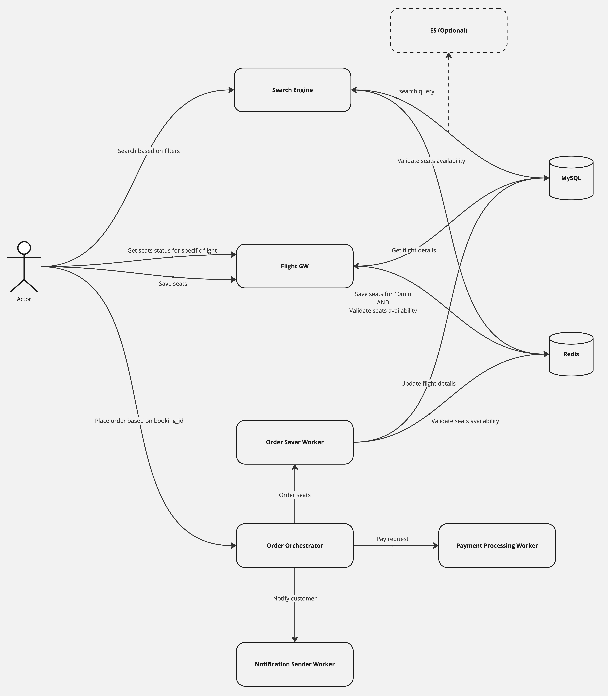
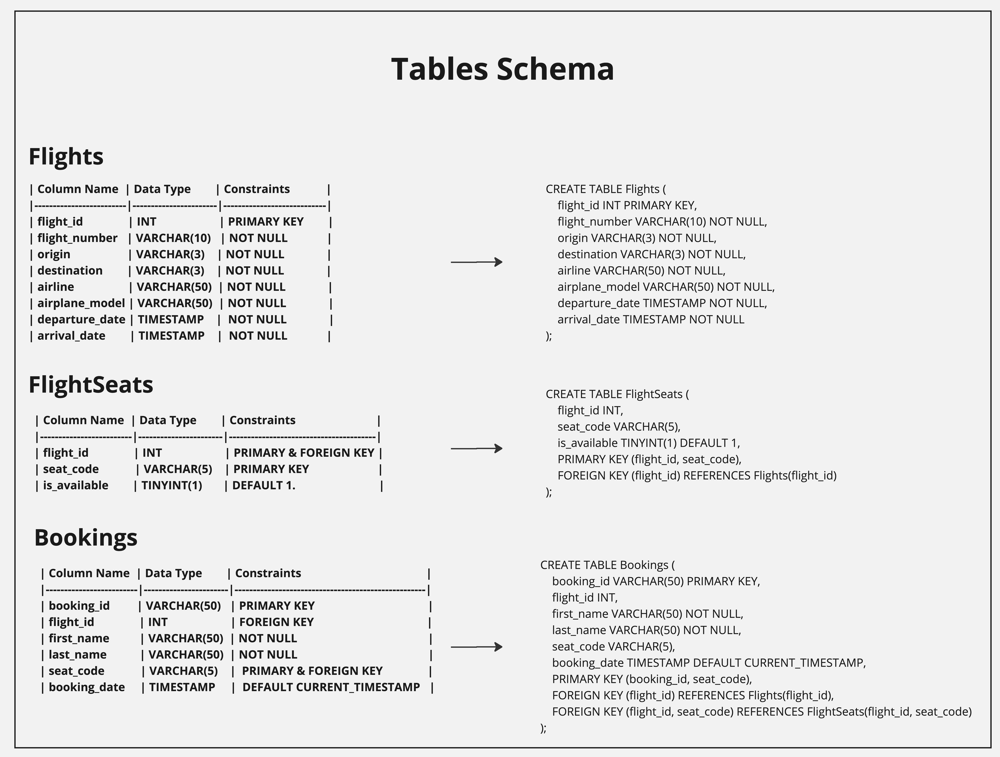
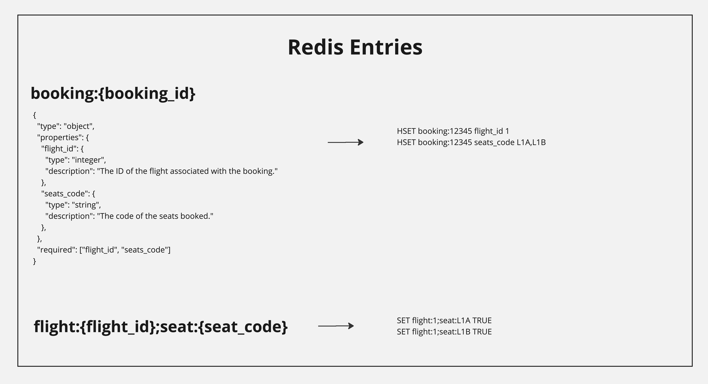

# Flight Ordering System

This project is a **Flight Ordering System** designed with a **microservices architecture** and implements the **SAGA pattern** to handle transactions across services. The system provides services for searching flights, reserving seats, and placing orders, ensuring consistency and reliability through distributed transactions.

## System Architecture




## Database Table Schemas



## Redis Entries Schemas



## Prerequisites

Before you start, ensure that you have the following software installed on your system:

- **TypeScript**: Version 4.3.5
- **pnpm**: Version 6.32.11
- **Docker**: Ensure Docker is installed for running the third-party services

### Docker Compose Setup

The third-party services required for this system (such as databases and messaging systems) can be started using Docker Compose. The `docker-compose.yml` file includes the necessary configuration for these services.

To bring up the third-party services, run:

```bash
docker-compose up
```

## Build and Run

###Build & Run Entire System
To build and run the entire system, run the following script located in the root package.json:

```bash
pnpm run build-and-run
```

This script will build and start all the services.

###Build Only the Libraries
To build only the shared libraries, run the following script:

```bash
pnpm run build-libs
```

###Initialize the Database and Cache
To initialize the database and cache, run the following script:

```bash
pnpm run "init db and cache"
```

##API Endpoints

###Search-Engine Service
* Purpose: Search for available flights based on given filters.
* Endpoint: http://localhost:3005
* Method: POST

Example cURL Request:

```bash
curl -X POST http://localhost:3005 \
-H "Content-Type: application/json" \
-d '{
    "origin": "NYC",
    "destination": "TLV",
    "number_of_seats": 2
}'
```

---

###Flight-Gateway Service
* Purpose 1: Get details about a specific flight and available seats.
* Endpoint: http://localhost:3000/flight_seats?id={some id}
* Method: GET

Example cURL Request:

```bash
curl -X GET "http://localhost:3000/flight_seats?id=123"
```

* Purpose 2: Save seats for 10 minutes.
* Endpoint: http://localhost:3000
* Method: POST

Example cURL Request:

```bash
curl -X POST http://localhost:3000 \
-H "Content-Type: application/json" \
-d '{
    "flight_id": "123",
    "seats": ["L1A", "L1B"]
}'
```
---

###Order-Orchestrator Service
* Purpose: Place an order.
* Endpoint: http://localhost:3002/order
* Method: POST

Example cURL Request:

```bash
curl -X POST http://localhost:3002/order \
-H "Content-Type: application/json" \
-d '{
    "booking_id": "booking123",
    "payment_details": {
        "card_number": "4111111111111111",
        "expiry_date": "12/24",
        "cvv": "123"
    },
    "passengers": [
        {
            "first_name": "John",
            "last_name": "Doe"
        },
        {
            "first_name": "Jane",
            "last_name": "Doe"
        }
    ]
}'
```

---

## Notes

- The `payment-manager` and `notification-center` services are dummy and not fully implemented. You can "play" with them to explore the SAGA pattern by modifying their responses.
- **Tests**: To be determined (TBD).
